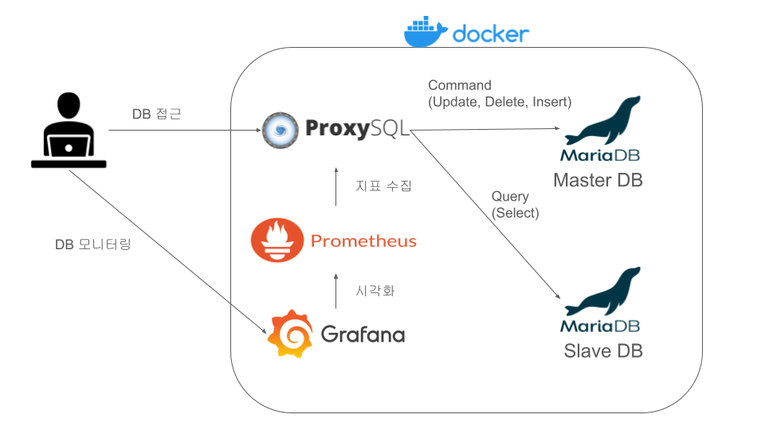
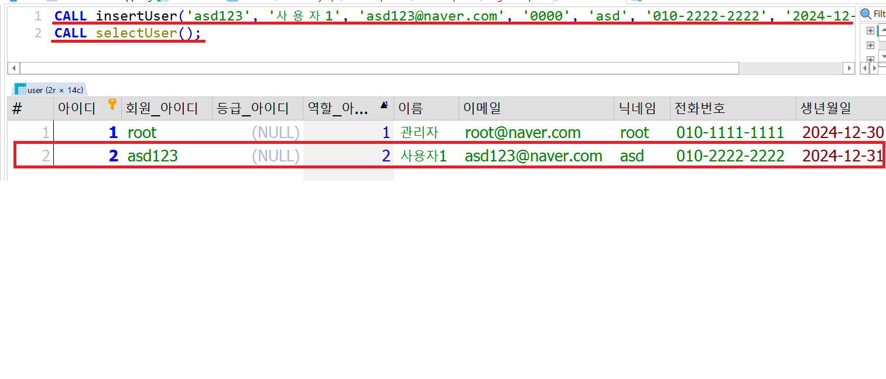
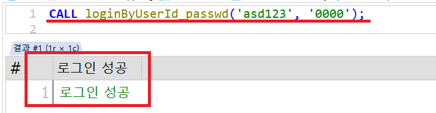
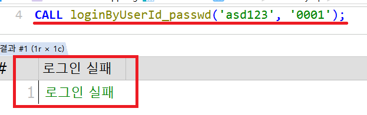
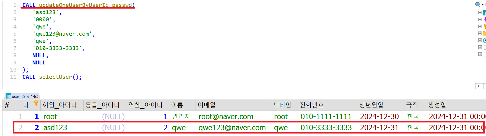

# Kppong

<br/>
<br/>
<br/>

# 🫡팀원소개
<!-- ### 🧑‍💻김범석 [ @g00dbyul ](https://github.com/g00dbyul)
### 🧑‍💻송현준 [ @Hyeonjunnn ](https://github.com/Hyeonjunnn)
### 👩‍💻이제경 [ @jelee55 ](https://github.com/jelee55)  
### 🧑‍💻이창신 [ @always0702 ](https://github.com/always0702) -->

| |  |||
| :------------------------------------------------------------: | :------------------------------------------------------------: |:------------------------------------------------------------: |:------------------------------------------------------------: |
|🧑‍💻김범석 [ @g00dbyul ](https://github.com/g00dbyul)|🧑‍💻송현준 [ @Hyeonjunnn ](https://github.com/Hyeonjunnn)|👩‍💻이제경 [ @jelee55 ](https://github.com/jelee55)|🧑‍💻이창신 [ @always0702 ](https://github.com/always0702)


<br/>
<br/>
<br/>


# 📣 프로젝트 소개
지금 이 순간에도 한류는 퍼져나가 K-POP, K-FOOD 열풍이 끊이지 않고 있습니다. 이에 발맞추어 대한민국을 찾는 외국인들도 점점 증가하는 추세입니다. 

현재 여러 여행 상품 플랫폼들이 존재하지만 국내 관광과 좀 더 밀접한 플랫폼을 만드는 것이 주 목적입니다.

"Kppong"은 국내 관광에 최적화된 카테고리, 체험 프로그램을 소개하고 방한하는 외국인들에게 즐거운 경험이 될 수 있도록하는 선택지를 늘려줍니다. 

또한 깨끗한 커뮤니티와 진정성 있는 액티비티를 위해 관리자가 관리하고 소통 창구를 통해 사용자 간의 의사소통을 지원합니다.

## 주요 기능
* 사용자는 마음에 드는 프로그램이 있다면 '찜'이라는 항목에 저장하여 추후에도 관심있는 프로그램에 쉽게 접근할 수 있습니다.

* 사용자는 마음에 드는 판매자에게 '즐겨찾기'로 등록하여 '즐겨찾기'로 판매자들을 분류하고 판매자들의 게시물을 빠르게 확인할 수 있습니다.

* 플랫폼 내에서 불량한 내용을 가진 프로그램을 제공하는 판매자나 같이 참여하는 입장에서 불편을 끼치거나 해를 입히는 사용자에게 경고를 주어 일정 이상 경고가 누적될 경우 플랫폼에서 퇴출되어 다시 접속할 수 없도록 합니다.

* 플랫폼 내에 게시판이 존재하여 사용자가 자유롭게 게시물을 작성할 수 있으며 댓글을 통해 서로 소통하며 정보 공유나 후기 등을 공유할 수 있도록 합니다.

<br/>
<br/>
<br/>

# 📄 WBS


<br/>
<br/>
<br/>

# 🍔 기술스택


<br/>
<br/>
<br/>


# ☀️ 아키텍처
 

## 설계의도

CQRS(Command Query Responsibility Segregation)
- 데이터의 명령(Command)과 조회(Query)를 분리하는 아키텍처 패턴
- 명령 작업과 조회 작업을 독립적으로 최적화 가능

Master - Slave Replication
- Proxysql을 통해 명령 작업은 Mater DB에 적용, 조회 작업은 Slave DB에서 조회
- 백업 및 트래픽 분산 가능


<br/>
<br/>
<br/>

# 📋 요구사항 명세서
<details>
<summary> <b> 요구사항 명세서 </b> </summary>
<div markdown="1">


</div>
</details>

<br/>
<br/>
<br/>

# 📌 ERD 다이어그램


<br/>
<br/>
<br/>

# 📑 테이블 명세서
[테이블 명세서](https://docs.google.com/spreadsheets/d/1NONU6XjPpvL1pyhDL7qoTbkmLXL2w381Yy1f9geL-EA/edit?gid=0#gid=0)
### 주요 테이블
<details>
<summary> <b> 주문 테이블 </b> </summary>
<div markdown="1">


->  주문 상태 속성에 대한 주요 기능

* 주문자 진행 상태인 주문을 취소할 수 있습니다
* 주문자가 확정, 취소 상태인 주문을 취소할 수 없습니다
* 주문자가 진행 상태인 주문을 결제하면 확정합니다
* 주문자가 확정, 취소 상태인 주문을 확정할 수 없습니다
</div>
</details>

<details>
<summary> <b> 유저 테이블 </b> </summary>
<div markdown="1">
	

-> 주요 기능
* 신고 기능 활용을 위한 신고 아이디 속성 포함합니다
* 제적 여부 속성을 통해 이후에도 서비스에 가입 불가합니다
</div>
</details>

<details>
<summary> <b> 신고 테이블 </b> </summary>
<div markdown="1">
	

-> 주요 기능
* 사용자나 패키지를 신고할 수 있게 합니다
* 신고 테이블에 데이터가 들어오면 사용자 경고를 받게 됩니다
  
</div>
</details>

<details>
<summary> <b> 사용자 경고 테이블 </b> </summary>
<div markdown="1">
	

-> 주요 기능
* 사용자의 데이터가 쌓여 3번 이상이 되는 회원이 발생하면 그 회원은 시스템의 접속이 불가능합니다
 
</div>
</details>


<br/>
<br/>
<br/>

# ✂️ 프로시저 명세서

<details>
<summary> <b> 프로시저 명세서 </b> </summary>
<div markdown="1">

 
 
 


</div>
</details>

<br/>
<br/>
<br/>

# 💻 테스트 명세서
<details>
<summary> <b> 테스트 명세서 </b> </summary>
<div markdown="1">


</div>
</details>

<br/>
<br/>
<br/>


# ✏️ SQL

<details>
<summary> <b> user </b> </summary>
<div markdown="1">

- 회원가입
```
DELIMITER $$
CREATE OR REPLACE PROCEDURE insertUser(
    IN _userId VARCHAR(15),
       `_name` VARCHAR(15),
       _email VARCHAR(40),
       _passwd VARCHAR(40),
       _nickname VARCHAR(15),
       _phoneNum VARCHAR(15),
       _birthAt DATE,
       _national VARCHAR(15)
       )
BEGIN
    -- 회원 아이디 중복 방지 조건문
    DECLARE _cnt INT;
	SET _cnt = (SELECT COUNT(*) 
                FROM user 
                WHERE userId = _userId
                   OR email = _email
                   OR phoneNum = _phoneNum
                );

    IF (
        _cnt < 1 
    )THEN
            INSERT INTO user (
                userId,
                `name`,
                email,
                passwd,
                nickName,
                phoneNum,
                birthAt,
                national,
                updatedAt
                )
            VALUES (
                _userId,
                `_name`,
                _email,
                _passwd,
                _nickname,
                _phoneNum,
                _birthAt,
                _national,
                NULL
                )
            ;
    ELSE
        SELECT '이미 존재하는 회원 정보입니다.';
            
    END IF;

END $$
DELIMITER ;
```


- 로그인
```
DELIMITER $$
CREATE OR REPLACE PROCEDURE loginByUserId_passwd(
    IN _userId VARCHAR(15),
       _passwd VARCHAR(40)
    )
BEGIN

	DECLARE _cnt INT;
	SET _cnt = (SELECT COUNT(*) 
                FROM user 
                WHERE userId = _userId
      				AND passwd = _passwd
                );

    IF (
        _cnt >= 1 
    )
    THEN
    	SELECT '로그인 성공';
    ELSE 
   	    SELECT '로그인 실패';
    END IF;
END $$
DELIMITER ;
```



- 개인정보 수정
```
DELIMITER $$
CREATE OR REPLACE PROCEDURE updateOneUser_passwdByUserId(
    IN _userId VARCHAR(15),
       _passwd VARCHAR(40),
       _updatePasswd VARCHAR(40)
    )
BEGIN
    DECLARE _cnt INT;
	SET _cnt = (SELECT COUNT(*) 
                FROM user 
                WHERE userId = _userId
                  AND passwd = _passwd);

    IF (
        _cnt >= 1 
    )THEN
        UPDATE user 
        SET passwd = _updatePasswd
        WHERE (userId = _userId
          AND passwd = _passwd);
    ELSE
        SELECT '아이디 또는 비밀번호를 확인해주세요' AS '인증 오류';
    END IF;

END $$
DELIMITER ;
```



</div>
</details>

<details>
<summary> <b> package </b> </summary>
<div markdown="1">

- 패키지 등록
  


- 조회


- 결과값


</div>
</details>

<details>
<summary> <b> order </b> </summary>
<div markdown="1">

- 등록
  


- 조회
  


- 결과값


- 에러(진행중인 패기지가 아니면 발생)
  


</div>
</details>


<br/>
<br/>
<br/>

