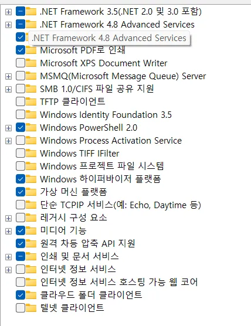

윈도우 환경 세팅

> Windows 마다 환경 차이가 있어서 안될 수도 있어요 ㅠ
> 
- 도커 설치
    - [Docker: Accelerated Container Application Development](https://www.docker.com/)
- 가상 환경 관련 설정
    - Windows 기능 켜기/끄기 → 다음과 같이 설정 → 확인 후 재부팅
    
    
    
    - Window Powershell 관리자 권한으로 실행해 다음 명령어 순서대로 실행
        
        ```jsx
        wsl --install
        wsl --update
        wsl --set-default-version 2
        ```
        
- Docker Desktop 실행
    - 좌측 하단에 Engine Running 이라고 실행되고 있어야 함.

Docker 실행은 Window PowerShell

- infra 디렉터리로 이동, `docker-compose up -d` 명령어 실행
- Master db 설정 조회  `docker exec -it master-db mariadb -u root -p -e "SHOW MASTER STATUS;"` 정상적으로 실행되면 다음과 같이 나옴(File, Position은 달라질 수 있음)

```sql
+------------------+----------+--------------+------------------+
| File             | Position | Binlog_Do_DB | Binlog_Ignore_DB |
+------------------+----------+--------------+------------------+
| mysql-bin.000002 |      342 |              |                  |
+------------------+----------+--------------+------------------+
```

- Slave db에 접속해 복제 설정을 수정해줘야 함(위, 쿼리에서 조회된 File, Position에 따라 아래 쿼리는 달라질 수 있음)

```sql
CHANGE MASTER TO
  MASTER_HOST='master-db',
  MASTER_USER='replica_user',
  MASTER_PASSWORD='replica_password',
  MASTER_LOG_FILE='mysql-bin.000002',
  MASTER_LOG_POS=342;
  
  // 복재 시작 
  START SLAVE;
 
 // Slave 상태 확인 
 SHOW SLAVE STATUS\G;
```

prometheus url : `http://localhost:9090`

grafana url : `http://localhost:3000`

데이터베이스 접속하기 : `mariadb -h 127.0.0.1 -P 6033 -u root -p`